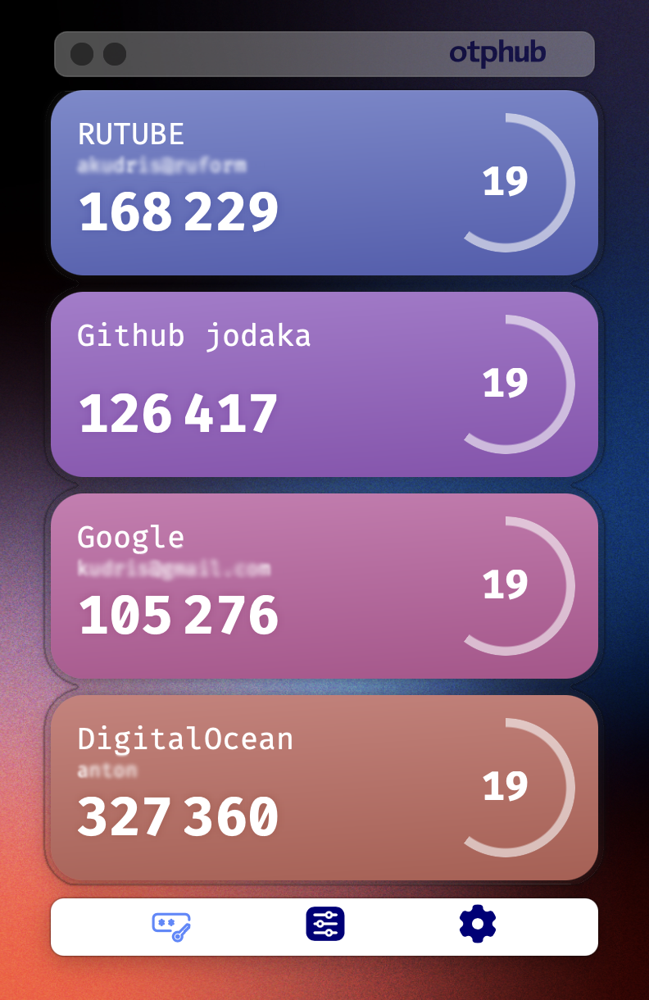

# OTPHub

A minimal TOTP (Time-based One-Time Password) code generator built with **Tauri v2**. 

## Features

- **TOTP Generation** — Generate time-based one-time passwords for multiple accounts
- **Cross-Platform** — macOS, Windows, Linux, Android, and iOS
- **Minimal UI** — Clean, distraction-free interface with live countdown timers
- **Token Management** — Reorder and delete tokens easily
- **Import / Export** — Backup and restore your tokens as JSON, including 2FAS export support
- **Mobile QR Scanning** — Add new accounts by scanning QR codes on Android/iOS
- **Keyboard Shortcuts** — Quick actions via keyboard (Cmd/Ctrl + E for export, + I for import, + Q to quit)

## Tech Stack

- **Backend:** Rust + Tauri v2
- **Frontend:** Vanilla JavaScript (ES modules, no bundler)
- **OTP Library:** [`otpauth`](https://github.com/hectorm/otpauth)
- **Styling:** Plain CSS with custom properties
